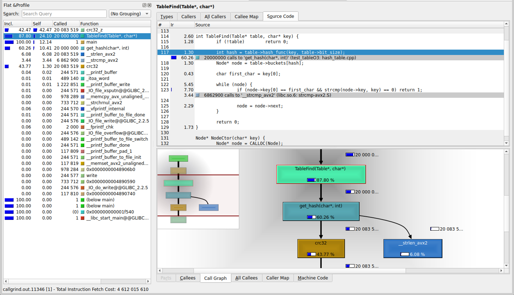
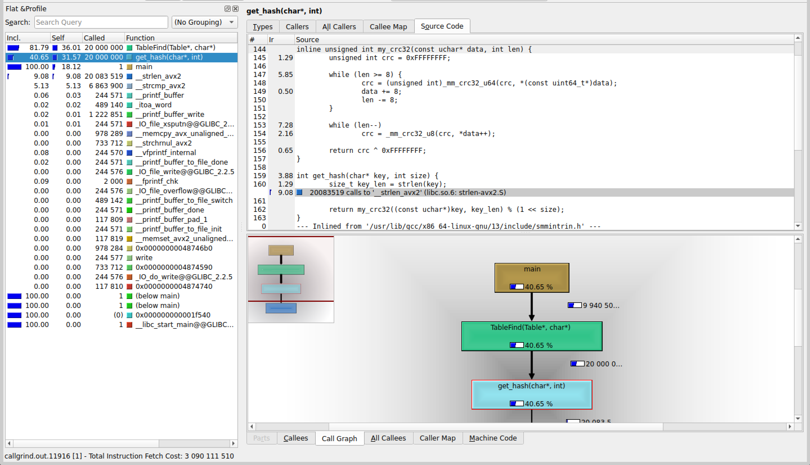
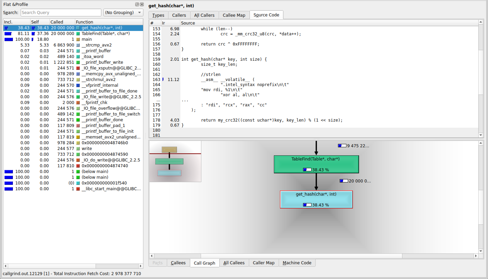
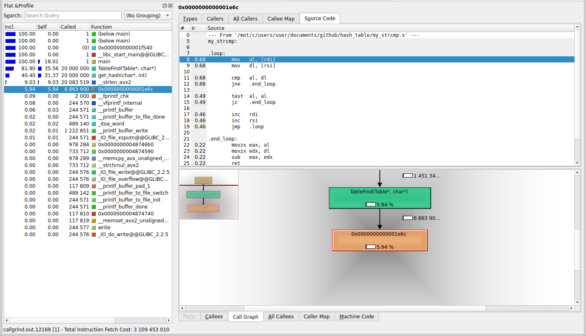

## Без оптимизаций кроме O3:
| Номер замера | Среднее количество тиков |
| :---: | :---: |
| 1 | 2230 |
| 2 | 2306 |
| 3 | 2272 |
| 4 | 2273 |
| 5 | 2257 |

Результаты без минимума и максимума: <b>2257</b>, <b>2272</b>, <b>2273</b>

Среднее количество тиков на <i>TableFind</i>:  <b>2267</b>



## Замена crc32 на intrinsic-и:

```c
inline unsigned int my_crc32(const uchar* data, int len) {
	unsigned int crc = 0xFFFFFFFF;

	while (len >= 8) {
		crc = (unsigned int)_mm_crc32_u64(crc, *(const uint64_t*)data);
		data += 8;
		len -= 8;
	}

	while (len--) 
		crc = _mm_crc32_u8(crc, *data++);

	return crc ^ 0xFFFFFFFF;
}
```

| Номер замера | Среднее количество тиков |
| :---: | :---: |
| 1 | 1907 |
| 2 | 1908 |
| 3 | 1934 |
| 4 | 1899 |
| 5 | 1926 |

Результаты без минимума и максимума: <b>1907</b>, <b>1908</b>, <b>1926</b>

Среднее количество тиков на <i>TableFind</i>:  <b>1914</b>

Получили ускорение на <b>(2267 - 1914) / 2267 * 100 = 15.57%</b>.



## Замена strlen на ассемблерную вставку:

```c
int get_hash(char* key, int size) {
	size_t key_len;

	// strlen
	__asm__ __volatile__ (
		".intel_syntax noprefix\n\t"
        "mov rdi, %1\n\t"
		"xor al, al\n\t"
		"mov rcx, -1\n\t"
		"repne scasb\n\t"
		"not rcx\n\t"
		"dec rcx\n\t"
		"mov %0, rcx\n\t"
		".att_syntax prefix\n\t"
        : "=r" (key_len)
        : "r" (key)
        : "rdi", "rcx", "rax", "cc"
    );
	
	return my_crc32((const uchar*)key, key_len) % (1 << size);
}
```

| Номер замера | Среднее количество тиков |
| :---: | :---: |
| 1 | 2124 |
| 2 | 2055 |
| 3 | 2008 |
| 4 | 2023 |
| 5 | 2049 |

Результаты без минимума и максимума: <b>2023</b>, <b>2049</b>, <b>2055</b>

Среднее количество тиков на <i>TableFind</i>:  <b>2042</b>

Получили, что оптимизация не сработала. :(



Поэтому не будем её использовать.

## Замена strcmp на my_strcmp из другого ассемблерного файла

| Номер замера | Среднее количество тиков |
| :---: | :---: |
| 1 | 1918 |
| 2 | 1957 |
| 3 | 1988 |
| 4 | 1960 |
| 5 | 1945 |

Результаты без минимума и максимума: <b>1945</b>, <b>1957</b>, <b>1960</b>

Среднее количество тиков на <i>TableFind</i>:  <b>1954</b>

Опять олучили, что оптимизация не сработала. :(



