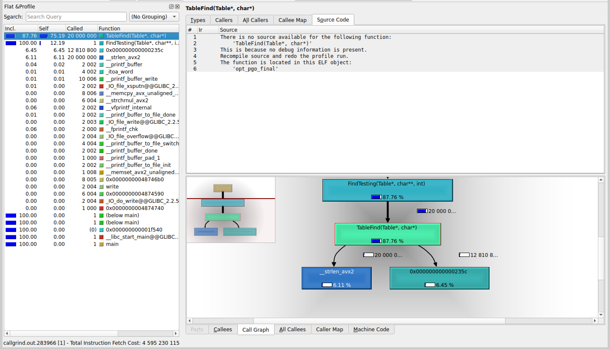

## -O3:

| Номер замера | Среднее количество тиков |
| :---: | :---: |
| 1 | 444 |
| 2 | 444 |
| 3 | 445 |
| 4 | 446 |
| 5 | 448 |
| 6 | 448 |
| 7 | 449 |

Результаты без минимума и максимума: $444$, $445$, $446$, $448$, $448$

Среднее количество тиков на <i>TableFind</i>: $446 
													\pm 2$

Относительная погрешность: $0.43\%$


## Замена strcmp на my_strcmp из ассемблерного файла

```
.intel_syntax noprefix
.global my_strcmp
.text

my_strcmp:

.loop:
	mov   al, [rdi]
	mov   dl, [rsi]

	cmp   al, dl
	jne   .end_loop

	test  al, al
	jz    .end_loop

	inc   rdi
	inc   rsi
	jmp   .loop

.end_loop:
	movzx eax, al
	movzx edx, dl
	sub   eax, edx
	ret

.section .note.GNU-stack, "", @progbits

```

| Номер замера | Среднее количество тиков |
| :---: | :---: |
| 1 | 380 |
| 2 | 384 |
| 3 | 389 |
| 4 | 390 |
| 5 | 392 |
| 6 | 393 |
| 7 | 395 |

Результаты без минимума и максимума: $384$, $389$, $390$, $392$, $393$

Среднее количество тиков на <i>TableFind</i>: $390 
													\pm 5$

Относительная погрешность: $1.27\%$

Получили ускорение на $\frac{446 - 390}{446} * 100 =
			12.56\% \pm 0.17$ $\%$ относительно -O3.

Относительная погрешность ускорения: 
			$\sqrt{0.43^2+1.27^2} =
			1.34\%$

Абсолютная погрешность: $12.56\% * 0.0134 = 
			0.17\%$


## Замена crc32 на intrinsic-и

```c
FORCE_INLINE unsigned int opt_crc32(const uchar* data, int len) {
	unsigned int crc = 0xFFFFFFFF;

	while (len >= 8) {
		crc = (unsigned int)_mm_crc32_u64(crc, *(const uint64_t*)data);
		data += 8;
		len -= 8;
	}

	while (len--) 
		crc = _mm_crc32_u8(crc, *data++);

	return crc ^ 0xFFFFFFFF;
}
```

| Номер замера | Среднее количество тиков |
| :---: | :---: |
| 1 | 354 |
| 2 | 355 |
| 3 | 355 |
| 4 | 355 |
| 5 | 356 |
| 6 | 364 |
| 7 | 368 |

Результаты без минимума и максимума: $355$, $355$, $355$, $356$, $364$

Среднее количество тиков на <i>TableFind</i>: $357 
													\pm 5$

Относительная погрешность: $1.47\%$

Полученное ускорение:

$\cdot$ на $\frac{390 - 357}{390} * 100 =
			8.46\% \pm 0.16$ $\%$ относительно предыдущей версии.

Относительная погрешность ускорения: 
			$\sqrt{1.27^2+1.47^2} =
			1.94\%$

Абсолютная погрешность: $8.46\% * 0.0194 = 
			0.16\%$


$\cdot$ на $\frac{446 - 357}{446} * 100 =
			19.96\% \pm 0.31$ $\%$ относительно -O3.

Относительная погрешность ускорения: 
			$\sqrt{0.43^2+1.47^2} =
			1.53\%$

Абсолютная погрешность: $19.96\% * 0.0153 = 
			0.31\%$


Рассмотрим ассемблерный вид <i>TableFind</i> c godbolt:

```
TableFind(Table*, char*):
        test    rdi, rdi
        je      .L14
        push    rbp
        mov     rbp, rsi
        push    rbx
        mov     rbx, rdi
        sub     rsp, 8
        mov     esi, DWORD PTR [rdi+4]
        mov     rdi, rbp
        call    [QWORD PTR [rbx+8]]
        mov     rdx, QWORD PTR [rbx+16]
        cdqe
        mov     rbx, QWORD PTR [rdx+rax*8]
        test    rbx, rbx
        jne     .L4
        jmp     .L2
.L18:
        mov     rbx, QWORD PTR [rbx+8]
        test    rbx, rbx
        je      .L2
.L4:
        mov     rdi, QWORD PTR [rbx]
        mov     rsi, rbp
        call    my_strcmp
        test    eax, eax
        jne     .L18
        add     rsp, 8
        mov     eax, 1
        pop     rbx
        pop     rbp
        ret
.L2:
        add     rsp, 8
        xor     eax, eax
        pop     rbx
        pop     rbp
        ret
.L14:
        xor     eax, eax
        ret
```

## Ассемблерная вставка, проверяющая первые символы строк

```c
int TableFind(Table* table, char* key) {
	if (!table || !key)	return 0;

	int hash = table->hash_func(key, table->bit_size);
	Node* node = table->buckets[hash];

	while (node) {
		asm volatile goto (
			".intel_syntax noprefix			\n\t"
			"mov	rsi,	%0				\n\t"
			"mov	rdi,	%1				\n\t"
			"mov	al,		BYTE PTR [rsi]	\n\t"
			"mov	dl,		BYTE PTR [rdi]	\n\t"

			"cmp	al,		dl				\n\t"
			"je		.eq						\n\t"
			"jmp	%l[next_elem]			\n\t"

			".eq:							\n\t"
			".att_syntax prefix				\n\t"
			:
			: "r" (node->key), "r" (key)
			: "rsi", "rdi", "rax", "rdx", "cc"
			: next_elem
		);

		if (my_strcmp(node->key, key) == 0) return 1;

	next_elem:
		node = node->next;
	}

	return 0;
}
```

| Номер замера | Среднее количество тиков |
| :---: | :---: |
| 1 | 331 |
| 2 | 338 |
| 3 | 339 |
| 4 | 339 |
| 5 | 340 |
| 6 | 341 |
| 7 | 342 |

Результаты без минимума и максимума: $338$, $339$, $339$, $340$, $341$

Среднее количество тиков на <i>TableFind</i>: $339 
													\pm 3$

Относительная погрешность: $1.01\%$

Полученное ускорение:

$\cdot$ на $\frac{357 - 339}{357} * 100 =
			5.04\% \pm 0.09$ $\%$ относительно предыдущей версии.

Относительная погрешность ускорения: 
			$\sqrt{1.47^2+1.01^2} =
			1.78\%$

Абсолютная погрешность: $5.04\% * 0.0178 = 
			0.09\%$


$\cdot$ на $\frac{446 - 339}{446} * 100 =
			23.99\% \pm 0.26$ $\%$ относительно -O3.

Относительная погрешность ускорения: 
			$\sqrt{0.43^2+1.01^2} =
			1.10\%$

Абсолютная погрешность: $23.99\% * 0.0110 = 
			0.26\%$


## Оптимизация с использованием профилирования (версии со всеми оптимизациями)

| Номер замера | Среднее количество тиков |
| :---: | :---: |
| 1 | 320 |
| 2 | 326 |
| 3 | 329 |
| 4 | 333 |
| 5 | 333 |
| 6 | 334 |
| 7 | 335 |

Результаты без минимума и максимума: $326$, $329$, $333$, $333$, $334$

Среднее количество тиков на <i>TableFind</i>: $331 
													\pm 5$

Относительная погрешность: $1.54\%$

Получили ускорение на $\frac{339 - 331}{339} * 100 =
			2.36\% \pm 0.04$ $\%$ относительно версии со всеми оптимизациями.

Относительная погрешность ускорения: 
			$\sqrt{1.01^2+1.54^2} =
			1.84\%$

Абсолютная погрешность: $2.36\% * 0.0184 = 
			0.04\%$


## Оптимизация с использованием профилирования (версии с -O3)

| Номер замера | Среднее количество тиков |
| :---: | :---: |
| 1 | 428 |
| 2 | 440 |
| 3 | 441 |
| 4 | 442 |
| 5 | 446 |
| 6 | 449 |
| 7 | 449 |

Результаты без минимума и максимума: $440$, $441$, $442$, $446$, $449$

Среднее количество тиков на <i>TableFind</i>: $444 
													\pm 7$

Относительная погрешность: $1.55\%$

Получили ускорение на $\frac{446 - 444}{446} * 100 =
			0.45\% \pm 0.01$ $\%$ относительно -O3.

Относительная погрешность ускорения: 
			$\sqrt{0.43^2+1.55^2} =
			1.61\%$

Абсолютная погрешность: $0.45\% * 0.0161 = 
			0.01\%$

