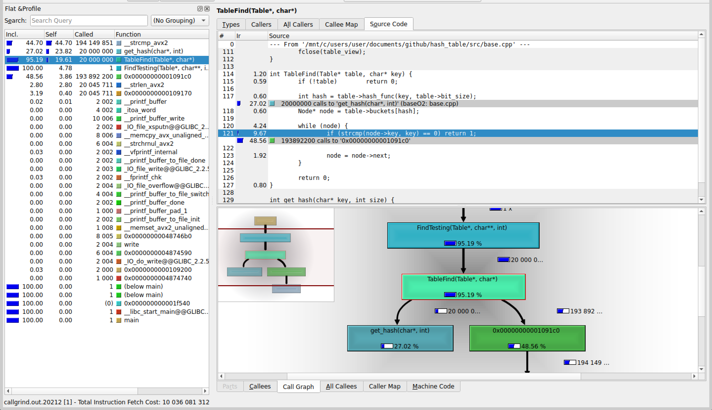
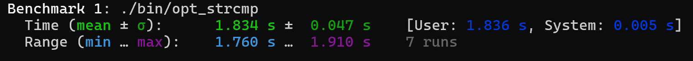
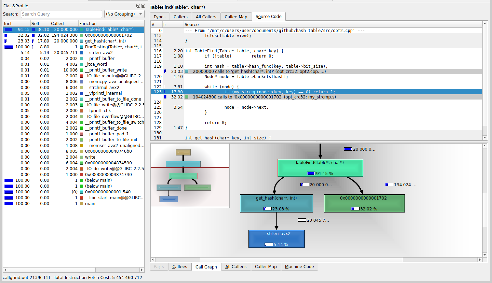
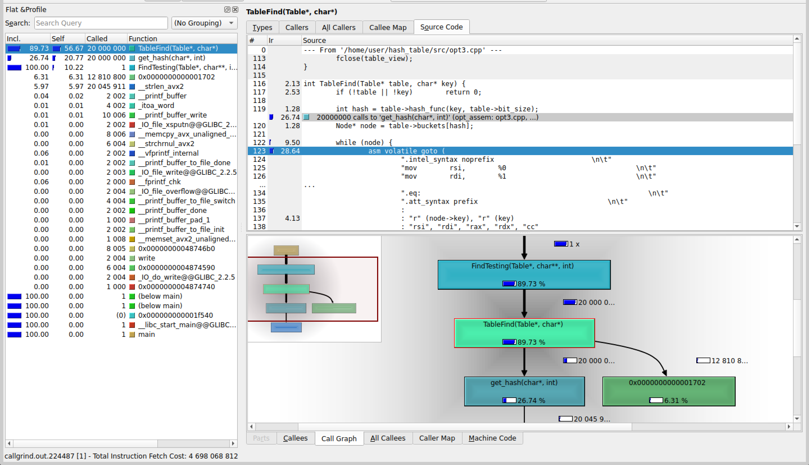

## Без оптимизаций, с -O2:
| Номер замера | Среднее количество тиков |
| :---: | :---: |
| 1 | 687 |
| 2 | 691 |
| 3 | 692 |
| 4 | 692 |
| 5 | 695 |
| 6 | 696 |
| 7 | 728 |

Результаты без минимума и максимума: $691$,  $692$,  $692$,  $695$,  $696$

Среднее количество тиков на <i>TableFind</i>: $693$

Относительная погрешность: $1.94\%$



## Замена strcmp на my_strcmp из ассемблерного файла

```
.intel_syntax noprefix
.global my_strcmp
.text

my_strcmp:

.loop:
	mov   al, [rdi]
	mov   dl, [rsi]

	cmp   al, dl
	jne   .end_loop

	test  al, al
	jz    .end_loop

	inc   rdi
	inc   rsi
	jmp   .loop

.end_loop:
	movzx eax, al
	movzx edx, dl
	sub   eax, edx
	ret
```

| Номер замера | Среднее количество тиков |
| :---: | :---: |
| 1 | 614 |
| 2 | 615 |
| 3 | 617 |
| 4 | 620 |
| 5 | 621 |
| 6 | 637 |
| 7 | 646 |

Результаты без минимума и максимума: $615$,  $617$,  $620$,  $621$,  $637$

Среднее количество тиков на <i>TableFind</i>:  $622$

Относительная погрешность: $1.87\%$

Получили ускорение на $\frac{693 - 622}{693} * 100 = 10.25\% \pm 0.28$ $\%$ относительно -O2.

Абсолютная погрешность: $10.25\% * \frac{\sqrt{1.94^2+1.87^2}}{100} = 10.25\% * 0.0269 = 0.28\%$

Относительная погрешность ускорения: $2.69\%$



## Замена crc32 на intrinsic-и:

```c
inline unsigned int opt_crc32(const uchar* data, int len) {
	unsigned int crc = 0xFFFFFFFF;

	while (len >= 8) {
		crc = (unsigned int)_mm_crc32_u64(crc, *(const uint64_t*)data);
		data += 8;
		len -= 8;
	}

	while (len--) 
		crc = _mm_crc32_u8(crc, *data++);

	return crc ^ 0xFFFFFFFF;
}
```

| Номер замера | Среднее количество тиков |
| :---: | :---: |
| 1 | 585 |
| 2 | 589 |
| 3 | 591 |
| 4 | 597 |
| 5 | 604 |
| 6 | 606 |
| 7 | 615 |

Результаты без минимума и максимума: $589$,  $591$,  $597$,  $604$,  $606$

Среднее количество тиков на <i>TableFind</i>: $597$

Относительная погрешность: $1.67\%$

Полученное ускорение:

$\cdot$ на $(622 - 597) / 622	* 100 = 4.02\% \pm 0.10$ $\%$ относительно предыдущей оптимизации.

Абсолютная погрешность: $4.02\% * \frac{\sqrt{1.87^2+1.67^2}}{100} = 4.02\% * 0.0250 = 0.10\%$

Относительная погрешность: $2.50\%$

$\cdot$ на $(693 - 597) / 693 * 100 = 13.85\% \pm 0.35$ $\%$ относительно -O2.

Абсолютная погрешность: $13.85\% * \frac{\sqrt{1.94^2+1.67^2}}{100} = 13.85\% * 0.0256 = 0.35\%$

Относительная погрешность: $2.56\%$



Рассмотрим ассемблерный вид <i>TableFind</i> c godbolt:
```
TableFind(Table*, char*):
        test    rdi, rdi
        je      .L14
        push    rbp
        mov     rbp, rsi
        push    rbx
        mov     rbx, rdi
        sub     rsp, 8
        mov     esi, DWORD PTR [rdi+4]
        mov     rdi, rbp
        call    [QWORD PTR [rbx+8]]
        mov     rdx, QWORD PTR [rbx+16]
        cdqe
        mov     rbx, QWORD PTR [rdx+rax*8]
        test    rbx, rbx
        jne     .L4
        jmp     .L2
.L18:
        mov     rbx, QWORD PTR [rbx+8]
        test    rbx, rbx
        je      .L2
.L4:
        mov     rdi, QWORD PTR [rbx]
        mov     rsi, rbp
        call    strcmp
        test    eax, eax
        jne     .L18
        add     rsp, 8
        mov     eax, 1
        pop     rbx
        pop     rbp
        ret
.L2:
        add     rsp, 8
        xor     eax, eax
        pop     rbx
        pop     rbp
        ret
.L14:
        xor     eax, eax
        ret
```

## Замена TableFind на ассемблерную вставку:

```c
int TableFind(Table* table, char* key) {
	__asm__ __volatile__ (
		".intel_syntax noprefix					\n\t"

		"test    rdi, rdi						\n\t"
        "je      .null_table					\n\t"
        "push    rbp							\n\t"
        "mov     rbp, rsi						\n\t"
        "push    rbx							\n\t"
        "mov     rbx, rdi						\n\t"
        "sub     rsp, 8							\n\t"
        "mov     esi, DWORD PTR [rdi+4]			\n\t"
        "mov     rdi, rbp						\n\t"
        "call    [QWORD PTR [rbx+8]]			\n\t"
        "mov     rdx, QWORD PTR [rbx+16]		\n\t"
        "cdqe									\n\t"
        "mov     rbx, QWORD PTR [rdx+rax*8]		\n\t"
        "test    rbx, rbx						\n\t"
        "jne     .check							\n\t"
        "jmp     .not_find						\n\t"

	".next_check:								\n\t"
        "mov     rbx, QWORD PTR [rbx+8]			\n\t"
        "test    rbx, rbx						\n\t"
        "je      .not_find						\n\t"

	".check:									\n\t"
        "mov     rdi, QWORD PTR [rbx]			\n\t"
        "mov     rsi, rbp						\n\t"
        "mov     al, BYTE PTR [rsi]				\n\t"	//	всё ради этих строк
		"mov	 cl, BYTE PTR [rdi]				\n\t"	//	перед тем как вызвать my_strcmp
		"cmp	 al, cl							\n\t"	//	сравниваем первые символы
		"jne	 .neq							\n\t"	//	наших строк
		"inc	 rsi							\n\t"
		"inc	 rdi							\n\t"
        "call    my_strcmp						\n\t"
	
	".neq:										\n\t"
        "test    eax, eax						\n\t"
        "jne     .next_check					\n\t"
        "add     rsp, 8							\n\t"
        "mov     eax, 1							\n\t"
        "pop     rbx							\n\t"
        "pop     rbp							\n\t"
        "ret									\n\t"

	".not_find:									\n\t"
        "add     rsp, 8							\n\t"
        "xor     eax, eax						\n\t"
        "pop     rbx							\n\t"
        "pop     rbp							\n\t"
        "ret									\n\t"

	".null_table:								\n\t"

		".att_syntax prefix						\n\t"
		: 
		:
		: "rax", "rcx", "rdx", "rsi", "rdi", "memory"
	);

	return 0;
}
```

| Номер замера | Среднее количество тиков |
| :---: | :---: |
| 1 | 523 |
| 2 | 533 |
| 3 | 534 |
| 4 | 536 |
| 5 | 536 |
| 6 | 547 |
| 7 | 599 |

Результаты без минимума и максимума: $533$,  $534$,  $536$,  $536$,  $547$

Среднее количество тиков на <i>TableFind</i>:  $537$

Относительная погрешность: $4.53\%$

Полученное ускорение:

$\cdot$ на $(597 - 537) / 597	* 100 = 10.05\% \pm 0.49$ $\%$ относительно предыдущей оптимизации.

Абсолютная погрешность: $10.05\% * \frac{\sqrt{1.67^2+4.53^2}}{100} = 4.02\% * 0.0483 = 0.49\%$

Относительная погрешность: $4.83\%$

$\cdot$ на $(693 - 537) / 693 * 100 = 22.51\% \pm 1.11$ $\%$ относительно -O2.

Абсолютная погрешность: $22.51\% * \frac{\sqrt{1.94^2+4.53^2}}{100} = 22.51\% * 0.0493 = 1.11\%$

Относительная погрешность: $4.93\%$



