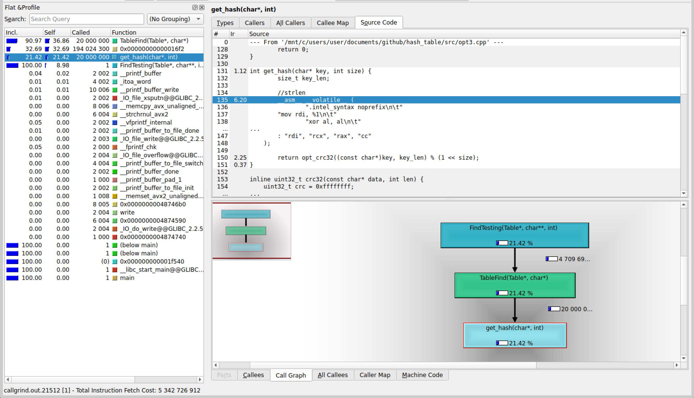

## Без оптимизаций, с -O2:
| Номер замера | Среднее количество тиков |
| :---: | :---: |
| 1 | 439 |
| 2 | 440 |
| 3 | 447 |
| 4 | 448 |
| 5 | 448 |
| 6 | 449 |
| 7 | 450 |

Результаты без минимума и максимума: $440$,  $447$,  $448$,  $448$,  $449$

Среднее количество тиков на <i>TableFind</i>: $446$

Относительная погрешность: $0.93\%$


## Замена strcmp на my_strcmp из ассемблерного файла

```
.intel_syntax noprefix
.global my_strcmp
.text

my_strcmp:

.loop:
	mov   al, [rdi]
	mov   dl, [rsi]

	cmp   al, dl
	jne   .end_loop

	test  al, al
	jz    .end_loop

	inc   rdi
	inc   rsi
	jmp   .loop

.end_loop:
	movzx eax, al
	movzx edx, dl
	sub   eax, edx
	ret
```

| Номер замера | Среднее количество тиков |
| :---: | :---: |
| 1 | 373 |
| 2 | 374 |
| 3 | 374 |
| 4 | 376 |
| 5 | 376 |
| 6 | 377 |
| 7 | 381 |

Результаты без минимума и максимума: $374$,  $374$,  $376$,  $376$,  $377$

Среднее количество тиков на <i>TableFind</i>:  $375$

Относительная погрешность: $0.67\%$

Получили ускорение на $\frac{446 - 375}{446} * 100 = 15.92\% \pm 0.18$ $\%$ относительно -O2.

Абсолютная погрешность: $15.92\% * \frac{\sqrt{0.93^2+0.67^2}}{100} = 15.92\% * 0.0115 = 0.18\%$

Относительная погрешность ускорения: $1.15\%$


## Замена crc32 на intrinsic-и:

```c
inline unsigned int opt_crc32(const uchar* data, int len) {
	unsigned int crc = 0xFFFFFFFF;

	while (len >= 8) {
		crc = (unsigned int)_mm_crc32_u64(crc, *(const uint64_t*)data);
		data += 8;
		len -= 8;
	}

	while (len--) 
		crc = _mm_crc32_u8(crc, *data++);

	return crc ^ 0xFFFFFFFF;
}
```

| Номер замера | Среднее количество тиков |
| :---: | :---: |
| 1 | 352 |
| 2 | 355 |
| 3 | 356 |
| 4 | 357 |
| 5 | 358 |
| 6 | 363 |
| 7 | 370 |

Результаты без минимума и максимума: $355$,  $356$,  $357$,  $358$,  $363$

Среднее количество тиков на <i>TableFind</i>: $358$

Относительная погрешность: $1.57\%$

Полученное ускорение:

$\cdot$ на $(375 - 358) / 375	* 100 = 4.53\% \pm 0.08$ $\%$ относительно предыдущей оптимизации.

Абсолютная погрешность: $4.53\% * \frac{\sqrt{0.67^2+1.57^2}}{100} = 4.53\% * 0.0171 = 0.08\%$

Относительная погрешность: $1.71\%$

$\cdot$ на $(446 - 358) / 446 * 100 = 19.73\% \pm 0.36$ $\%$ относительно -O2.

Абсолютная погрешность: $19.73\% * \frac{\sqrt{0.93^2+1.57^2}}{100} = 19.73\% * 0.0182 = 0.36\%$

Относительная погрешность: $1.82\%$


## Замена strlen на ассемблерную вставку:

```c
int get_hash(char* key, int size) {
	size_t key_len;

	// strlen
	__asm__ __volatile__ (
		".intel_syntax noprefix\n\t"
        "mov rdi, %1\n\t"
		"xor al, al\n\t"
		"mov rcx, -1\n\t"
		"repne scasb\n\t"
		"not rcx\n\t"
		"dec rcx\n\t"
		"mov %0, rcx\n\t"
		".att_syntax prefix\n\t"
        : "=r" (key_len)
        : "r" (key)
        : "rdi", "rcx", "rax", "cc"
    );
	
	return opt_crc32((const uchar*)key, key_len) % (1 << size);
}
```

| Номер замера | Среднее количество тиков |
| :---: | :---: |
| 1 | 375 |
| 2 | 381 |
| 3 | 382 |
| 4 | 382 |
| 5 | 385 |
| 6 | 385 |
| 7 | 394 |

Результаты без минимума и максимума: $381$,  $382$,  $382$,  $385$,  $385$

Среднее количество тиков на <i>TableFind</i>:  $383$

Относительная погрешность: $1.39\%$

Получили, что оптимизация не сработала (на $6.98\% \pm 0.15\%$ стало медленнее) :(



