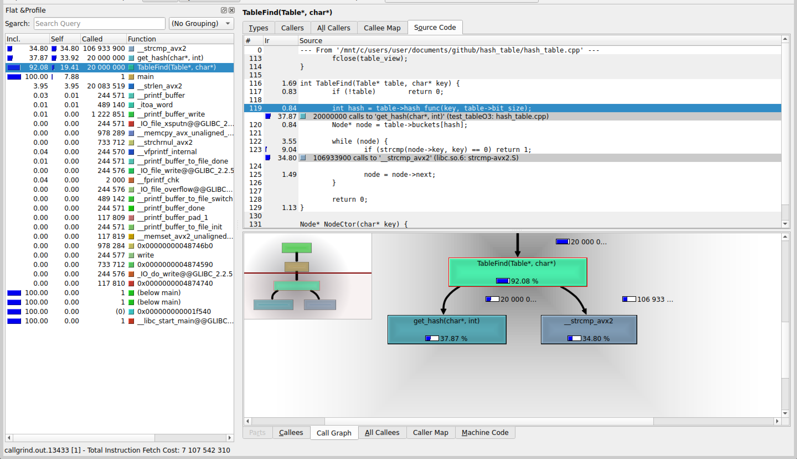
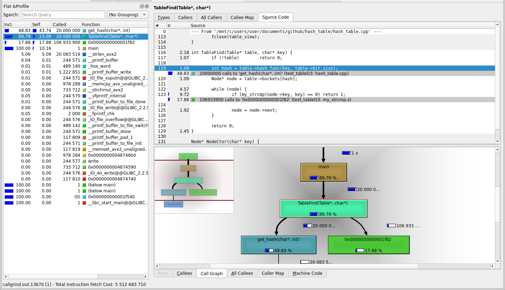

## Без оптимизаций, c -O0:
| Номер замера | Среднее количество тиков |
| :---: | :---: |
| 1 | 4148 |
| 2 | 3998 |
| 3 | 4087 |
| 4 | 4026 |
| 5 | 4114 |

Результаты без минимума и максимума: <b>4026</b>, <b>4087</b>, <b>4114</b>

Среднее количество тиков на <i>TableFind</i>:  <b>4076</b>

Погрешность: $1.75\%$ 

Абсолютная погрешность: $71$ тик

## Без оптимизаций, с -O3:
| Номер замера | Среднее количество тиков |
| :---: | :---: |
| 1 | 3992 | 3804
| 2 | 3955 | 3849
| 3 | 3940 | 3906
| 4 | 3996 | 3921
| 5 | 3908 | 3748

Результаты без минимума и максимума: <b>3804</b>, <b>3849</b>, <b>3906</b>

Среднее количество тиков на <i>TableFind</i>:  <b>3853</b>

Погрешность: $2.16\%$

Абсолютная погрешность: $83$ тика

Даже с учётом погрешностей, получаем, что способ с -O3 быстрее.



## Замена strcmp на my_strcmp из ассемблерного файла

```
.intel_syntax noprefix
.global my_strcmp
.text

my_strcmp:

.loop:
	mov   al, [rdi]
	mov   dl, [rsi]

	cmp   al, dl
	jne   .end_loop

	test  al, al
	jz    .end_loop

	inc   rdi
	inc   rsi
	jmp   .loop

.end_loop:
	movzx eax, al
	movzx edx, dl
	sub   eax, edx
	ret
```

| Номер замера | Среднее количество тиков |
| :---: | :---: |
| 1 | 2933 |
| 2 | 2953 |
| 3 | 2924 |
| 4 | 2880 |
| 5 | 2967 |

Результаты без минимума и максимума: <b>2924</b>, <b>2933</b>, <b>2953</b>

Среднее количество тиков на <i>TableFind</i>:  <b>2937</b>

Погрешность: $1.33\%$

Получили ускорение на $\frac{3853 - 2937}{3853} * 100 = 23.77\%$.

Абсолютная погрешность: $23.77 * \frac{\sqrt{2.16^2+1.33^2}}{100} = 23.77 * 0.0254 = 0.6\%$



## Замена crc32 на intrinsic-и:

```c
inline unsigned int opt_crc32(const uchar* data, int len) {
	unsigned int crc = 0xFFFFFFFF;

	while (len >= 8) {
		crc = (unsigned int)_mm_crc32_u64(crc, *(const uint64_t*)data);
		data += 8;
		len -= 8;
	}

	while (len--) 
		crc = _mm_crc32_u8(crc, *data++);

	return crc ^ 0xFFFFFFFF;
}
```

| Номер замера | Среднее количество тиков |
| :---: | :---: |
| 1 | 3043 |
| 2 | 3049 |
| 3 | 3004 |
| 4 | 2943 |
| 5 | 3069 |

Результаты без минимума и максимума: <b>3004</b>, <b>3043</b>, <b>3049</b>

Среднее количество тиков на <i>TableFind</i>:  <b>3032</b>

Получили ускорение на <b>(3345 - 3032) / 3345 * 100 = 9.36%</b>.


## Замена strlen на ассемблерную вставку:

```c
int get_hash(char* key, int size) {
	size_t key_len;

	// strlen
	__asm__ __volatile__ (
		".intel_syntax noprefix\n\t"
        "mov rdi, %1\n\t"
		"xor al, al\n\t"
		"mov rcx, -1\n\t"
		"repne scasb\n\t"
		"not rcx\n\t"
		"dec rcx\n\t"
		"mov %0, rcx\n\t"
		".att_syntax prefix\n\t"
        : "=r" (key_len)
        : "r" (key)
        : "rdi", "rcx", "rax", "cc"
    );
	
	return my_crc32((const uchar*)key, key_len) % (1 << size);
}
```

| Номер замера | Среднее количество тиков |
| :---: | :---: |
| 1 | 3144 |
| 2 | 3192 |
| 3 | 3121 |
| 4 | 3125 |
| 5 | 3119 |

Результаты без минимума и максимума: <b>3121</b>, <b>3125</b>, <b>3144</b>

Среднее количество тиков на <i>TableFind</i>:  <b>3130</b>

Получили, что оптимизация не сработала (на 3.23% стало медленнее). :(


