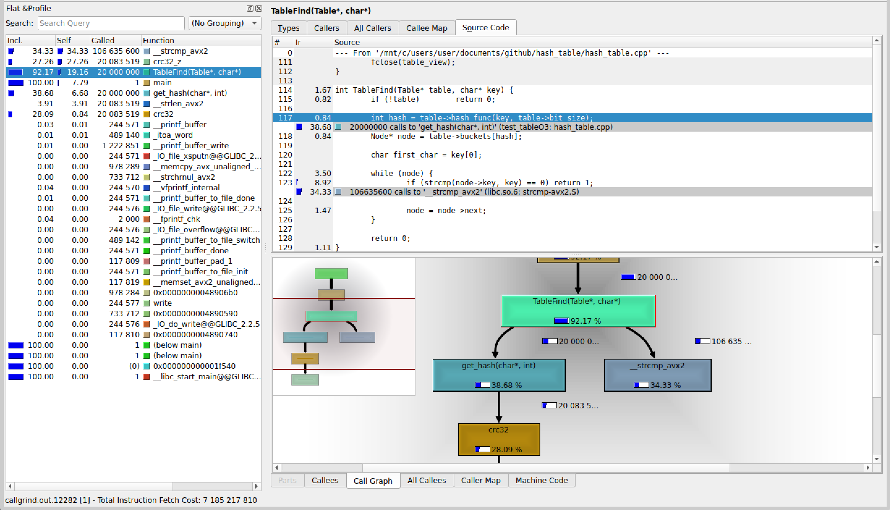
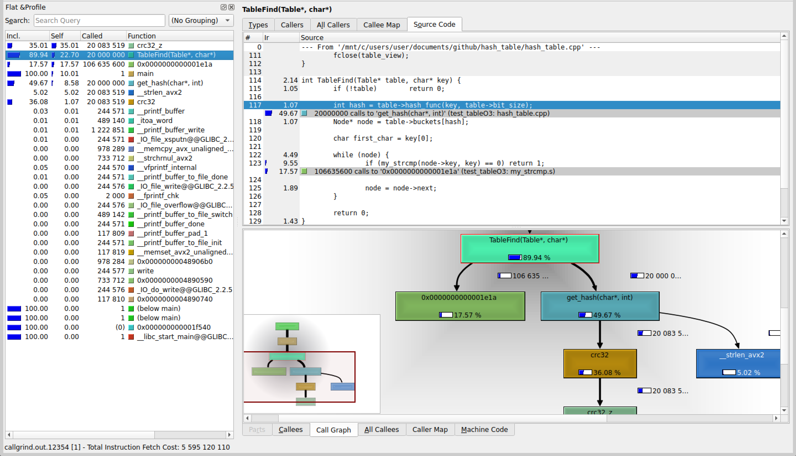
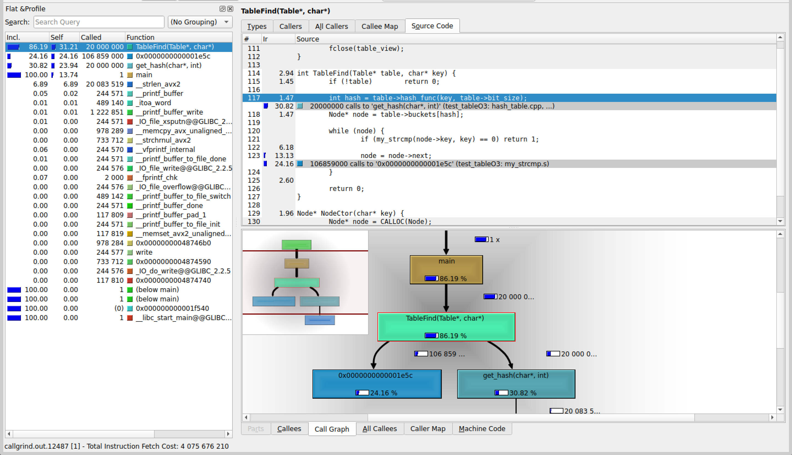
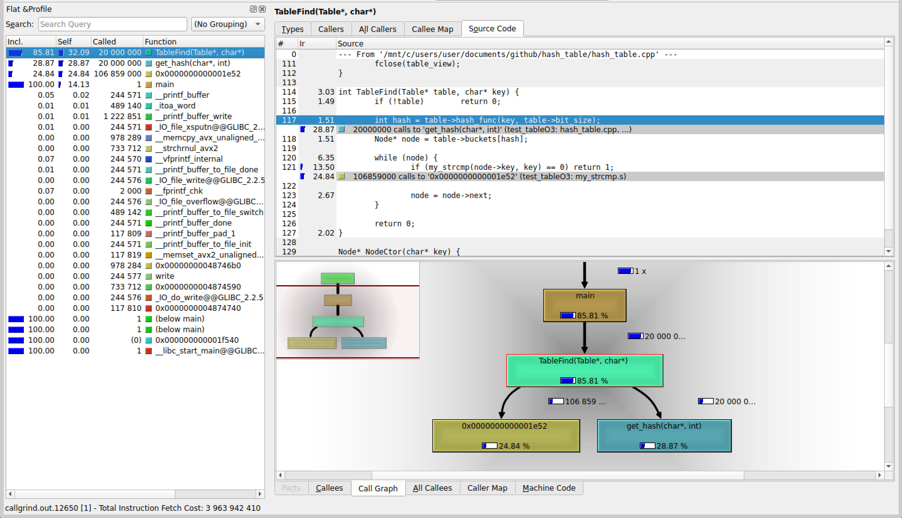
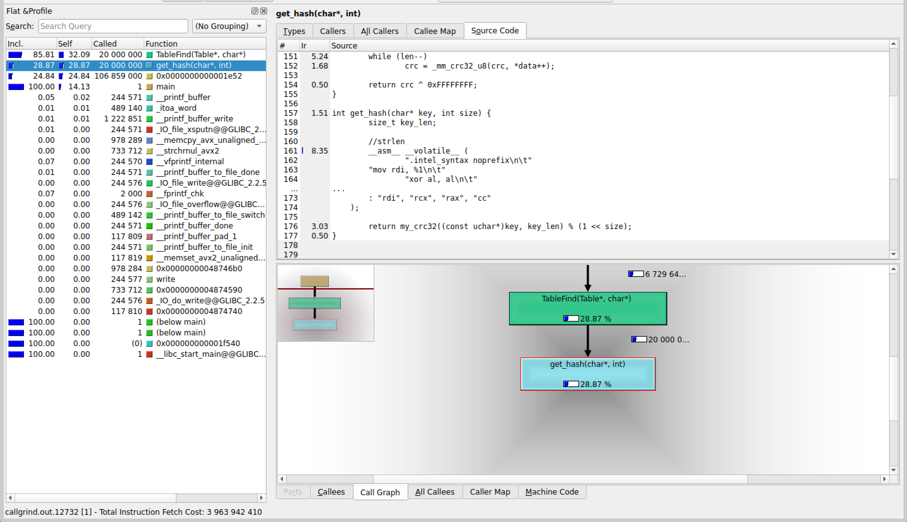

## Без оптимизаций кроме O3:
| Номер замера | Среднее количество тиков |
| :---: | :---: |
| 1 | 4202 |
| 2 | 4037 |
| 3 | 4190 |
| 4 | 4231 |
| 5 | 4194 |

Результаты без минимума и максимума: <b>4190</b>, <b>4194</b>, <b>4202</b>

Среднее количество тиков на <i>TableFind</i>:  <b>4195</b>



## Замена strcmp на my_strcmp из другого ассемблерного файла

```
.intel_syntax noprefix
.global my_strcmp
.text

my_strcmp:

.loop:
	mov   al, [rdi]
	mov   dl, [rsi]

	cmp   al, dl
	jne   .end_loop

	test  al, al
	jz    .end_loop

	inc   rdi
	inc   rsi
	jmp   .loop

.end_loop:
	movzx eax, al
	movzx edx, dl
	sub   eax, edx
	ret
```

| Номер замера | Среднее количество тиков |
| :---: | :---: |
| 1 | 3267 |
| 2 | 3586 |
| 3 | 3330 |
| 4 | 3437 |
| 5 | 3280 |

Результаты без минимума и максимума: <b>3267</b>, <b>3330</b>, <b>3437</b>

Среднее количество тиков на <i>TableFind</i>:  <b>3345</b>

Получили ускорение на <b>(4195 - 3345) / 4195 * 100 = 20.26%</b>.



## Замена crc32 на intrinsic-и:

```c
inline unsigned int my_crc32(const uchar* data, int len) {
	unsigned int crc = 0xFFFFFFFF;

	while (len >= 8) {
		crc = (unsigned int)_mm_crc32_u64(crc, *(const uint64_t*)data);
		data += 8;
		len -= 8;
	}

	while (len--) 
		crc = _mm_crc32_u8(crc, *data++);

	return crc ^ 0xFFFFFFFF;
}
```

| Номер замера | Среднее количество тиков |
| :---: | :---: |
| 1 | 3043 |
| 2 | 3049 |
| 3 | 3004 |
| 4 | 2943 |
| 5 | 3069 |

Результаты без минимума и максимума: <b>3004</b>, <b>3043</b>, <b>3049</b>

Среднее количество тиков на <i>TableFind</i>:  <b>3032</b>

Получили ускорение на <b>(3345 - 3032) / 3345 * 100 = 9.36%</b>.



## Замена strlen на ассемблерную вставку:

```c
int get_hash(char* key, int size) {
	size_t key_len;

	// strlen
	__asm__ __volatile__ (
		".intel_syntax noprefix\n\t"
        "mov rdi, %1\n\t"
		"xor al, al\n\t"
		"mov rcx, -1\n\t"
		"repne scasb\n\t"
		"not rcx\n\t"
		"dec rcx\n\t"
		"mov %0, rcx\n\t"
		".att_syntax prefix\n\t"
        : "=r" (key_len)
        : "r" (key)
        : "rdi", "rcx", "rax", "cc"
    );
	
	return my_crc32((const uchar*)key, key_len) % (1 << size);
}
```

| Номер замера | Среднее количество тиков |
| :---: | :---: |
| 1 | 3144 |
| 2 | 3192 |
| 3 | 3121 |
| 4 | 3125 |
| 5 | 3119 |

Результаты без минимума и максимума: <b>3121</b>, <b>3125</b>, <b>3144</b>

Среднее количество тиков на <i>TableFind</i>:  <b>3130</b>

Получили, что оптимизация не сработала (на 3.23% стало медленнее). :(




