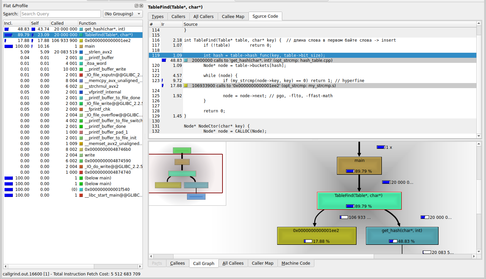
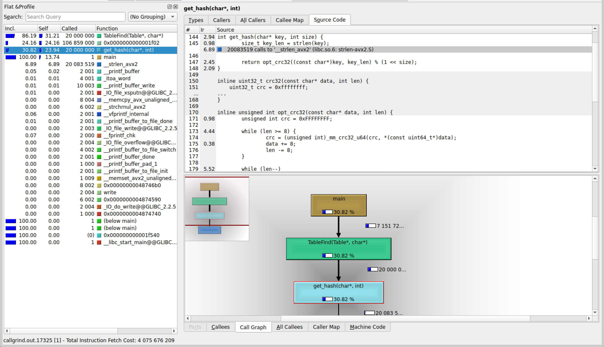

## Без оптимизаций, с -O3:
| Номер замера | Среднее количество тиков |
| :---: | :---: |
| 1 | 322 |
| 2 | 329 |
| 3 | 330 |
| 4 | 331 |
| 5 | 331 |
| 6 | 331 |
| 7 | 335 |

Результаты без минимума и максимума: $329$,  $330$,  $331$,  $331$,  $331$

Среднее количество тиков на <i>TableFind</i>: $330$

Погрешность: $1.11\%$


## Замена strcmp на my_strcmp из ассемблерного файла

```
.intel_syntax noprefix
.global my_strcmp
.text

my_strcmp:

.loop:
	mov   al, [rdi]
	mov   dl, [rsi]

	cmp   al, dl
	jne   .end_loop

	test  al, al
	jz    .end_loop

	inc   rdi
	inc   rsi
	jmp   .loop

.end_loop:
	movzx eax, al
	movzx edx, dl
	sub   eax, edx
	ret
```

| Номер замера | Среднее количество тиков |
| :---: | :---: |
| 1 | 277 |
| 2 | 278 |
| 3 | 282 |
| 4 | 289 |
| 5 | 290 |
| 6 | 290 |
| 7 | 297 |

Результаты без минимума и максимума: $278$,  $282$,  $289$,  $290$,  $290$

Среднее количество тиков на <i>TableFind</i>:  $285$

Погрешность: $2.38\%$

Получили ускорение на $\frac{330 - 285}{330} * 100 = 13.64 \pm 0.36$ $\%$ относительно O3.

Абсолютная погрешность: $13.64 * \frac{\sqrt{1.11^2+2.38^2}}{100} = 13.64 * 0.0263 = 0.36\%$



## Замена crc32 на intrinsic-и:

```c
inline unsigned int opt_crc32(const uchar* data, int len) {
	unsigned int crc = 0xFFFFFFFF;

	while (len >= 8) {
		crc = (unsigned int)_mm_crc32_u64(crc, *(const uint64_t*)data);
		data += 8;
		len -= 8;
	}

	while (len--) 
		crc = _mm_crc32_u8(crc, *data++);

	return crc ^ 0xFFFFFFFF;
}
```

| Номер замера | Среднее количество тиков |
| :---: | :---: |
| 1 | 266 |
| 2 | 268 |
| 3 | 269 |
| 4 | 270 |
| 5 | 272 |
| 6 | 272 |
| 7 | 273 |

Результаты без минимума и максимума: $268$,  $269$,  $270$,  $272$,  $272$

Среднее количество тиков на <i>TableFind</i>: $270$

Погрешность: $0.86\%$

Полученное ускорение:

$\cdot$ на $(285 - 270) / 285	* 100 = 5.26 \pm 0.13$ $\%$ относительно предыдущей оптимизации.

Погрешность: $5.26 * \frac{\sqrt{0.86^2+2.38^2}}{100} = 13.64 * 0.0263 = 0.13\%$

$\cdot$ на $(330 - 270) / 330 * 100 = 18.18 \pm 0.26$ $\%$ относительно O3.

Погрешность: $18.18 * \frac{\sqrt{0.86^2+1.11^2}}{100} = 13.64 * 0.0263 = 0.26\%$



## Замена strlen на ассемблерную вставку:

```c
int get_hash(char* key, int size) {
	size_t key_len;

	// strlen
	__asm__ __volatile__ (
		".intel_syntax noprefix\n\t"
        "mov rdi, %1\n\t"
		"xor al, al\n\t"
		"mov rcx, -1\n\t"
		"repne scasb\n\t"
		"not rcx\n\t"
		"dec rcx\n\t"
		"mov %0, rcx\n\t"
		".att_syntax prefix\n\t"
        : "=r" (key_len)
        : "r" (key)
        : "rdi", "rcx", "rax", "cc"
    );
	
	return my_crc32((const uchar*)key, key_len) % (1 << size);
}
```

| Номер замера | Среднее количество тиков |
| :---: | :---: |
| 1 | 3144 |
| 2 | 3192 |
| 3 | 3121 |
| 4 | 3125 |
| 5 | 3119 |

Результаты без минимума и максимума: <b>3121</b>, <b>3125</b>, <b>3144</b>

Среднее количество тиков на <i>TableFind</i>:  <b>3130</b>

Получили, что оптимизация не сработала (на 3.23% стало медленнее). :(


